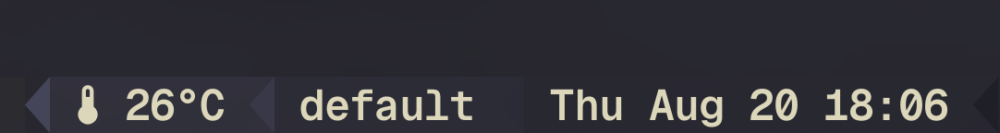

<p align="center">
  
</p>

<h1 align="center"><code><b>sensors.rs</b></code></h1>

A fast, dependency-free Rust implementation of lm-sensors' `sensors(1)` that
works the same way on **macOS** and **Linux**.

macOS has no `sensors`, which breaks every tool that scrapes it — most notably
the [tmux-cpu](https://github.com/tmux-plugins/tmux-cpu) plugin. This project
provides a drop-in `sensors` binary that reads real hardware sensors on a Mac
and prints them in the exact format lm-sensors uses.

```
$ sensors
cpu_thermal-hid-0
Adapter: HID Sensors
Package id 0:  +47.0°C
Core 0:        +45.0°C
Core 1:        +46.5°C
Core 2:        +48.0°C
Core 3:        +49.5°C

applesmc-isa-0300
Adapter: SMC
Fan 1:         1234 RPM  (min = 1200 RPM, max = 5500 RPM)
System total (PSTR):  12.50 W
```

## Highlights

* **Zero dependencies.** No crates at all — macOS support is raw IOKit /
  CoreFoundation FFI, Linux support is plain sysfs reads.
* **Fast.** ~0.4 ms per invocation, which matters when tmux runs it on every
  status-line refresh.
* **Format compatible.** Column alignment, `+45.0°C` value formatting and the
  `Core N:` labels match libsensors byte for byte, so existing scrapers work
  unchanged.
* **No sudo required** on macOS.
* Single self-contained binary, ~400 KB stripped.

## Install

### curl | sh (macOS & Linux, prebuilt binary)

```sh
curl -fsSL https://raw.githubusercontent.com/timonviola/sensors.rs/HEAD/install.sh | sh
```

Installs to `~/.local/bin` (or `/usr/local/bin` when run as root). Override with
`SENSORS_INSTALL=/usr/local/bin` and pin a release with `SENSORS_VERSION=0.1.0`.
Checksums are verified against the release `SHA256SUMS`.

### Homebrew

```sh
brew install timonviola/tap/sensors-rs
```

### Cargo

```sh
cargo install sensors-rs            # from crates.io
cargo install --git https://github.com/timonviola/sensors.rs   # from git
cargo install --path .              # from a checkout
```

### Nix

```sh
nix run github:timonviola/sensors.rs             # run without installing
nix profile install github:timonviola/sensors.rs # install into your profile
```

### Manual

Download a tarball for your platform from the
[releases page](https://github.com/timonviola/sensors.rs/releases) and drop the
`sensors` binary somewhere on `PATH`:

```sh
cargo build --release && cp target/release/sensors ~/.local/bin/
```

Make sure the install directory is on `PATH` before anything else that might
provide a `sensors` binary.

## Releasing

Releases are fully automated. Bump `version` in `Cargo.toml`, then:

```sh
git tag v0.1.0 && git push origin v0.1.0
```

`.github/workflows/release.yml` then builds macOS (arm64/x86_64) and Linux
(arm64/x86_64, gnu + musl) binaries, publishes a GitHub release with
`SHA256SUMS`, pushes to crates.io (needs the `CARGO_REGISTRY_TOKEN` secret) and
updates the Homebrew tap (needs the `HOMEBREW_TAP_TOKEN` secret and a
`timonviola/homebrew-tap` repo). Jobs without their secret are skipped, not failed.

## Usage

```
Usage: sensors [OPTION]... [CHIP]...

  -A, --no-adapter   do not print the adapter for each chip
  -f, --fahrenheit   show temperatures in degrees Fahrenheit
  -j, --json         output readings as JSON
  -u, --raw          raw output (one sub-feature per line)
  -c FILE            ignored, accepted for lm-sensors compatibility
  -h, --help         display this help and exit
  -v, --version      display version information and exit
```

`CHIP` filters the output and accepts a bare prefix (`coretemp`), a full chip
name (`coretemp-isa-0000`) or `*` wildcards (`coretemp-*-*`).

```sh
sensors                 # everything
sensors cpu_thermal     # just the CPU chip
sensors -f              # Fahrenheit
sensors -j              # JSON, for scripting
sensors -u applesmc     # raw sub-feature values
```

## tmux-cpu integration

`tmux-cpu` runs `sensors` and averages every line matching `^Core [0-9]+`.
Once this binary is on `PATH`, `#{cpu_temp}` starts working on macOS with no
plugin changes:

```tmux
set -g @plugin 'tmux-plugins/tmux-cpu'
set -g status-right '#{cpu_temp} #{cpu_percentage}'
```

CPU *percentage* already works on macOS through the plugin's own `ps`-based
path, so no extra tooling is needed for it.

## WezTerm status bar

`examples/wezterm/` contains a drop-in plugin that shows the CPU temperature in
the WezTerm status bar, refreshed every 2 seconds:

```sh
mkdir -p ~/.config/wezterm
cp examples/wezterm/cpu_temp.lua ~/.config/wezterm/
```

```lua
-- ~/.wezterm.lua
local wezterm = require 'wezterm'
local config = wezterm.config_builder()

package.path = wezterm.config_dir .. '/?.lua;' .. package.path
require('cpu_temp').setup {
  config = config,   -- sets status_update_interval for you
  interval = 2,      -- seconds
  unit = 'C',
}

return config
```

Result: a colour-coded `CPU 47°C` on the right of the status bar (green below
65 °C, yellow below 80 °C, red above).

Notes:

* GUI apps on macOS do not inherit your shell `PATH`, so the binary is looked
  up in `~/.local/bin`, `~/.cargo/bin`, `/opt/homebrew/bin`, `/usr/local/bin`
  and `/usr/bin`. Set `command = '/path/to/sensors'` if yours lives elsewhere.
  A missing binary is handled gracefully: `wezterm.run_child_process` raises on
  a bad path, so the call is wrapped in `pcall`.
* Readings are cached for `interval` seconds, so a lower
  `status_update_interval` never spawns extra processes.
* The status item never disappears. A failed refresh keeps showing the last
  reading for `stale_after` seconds (30 by default); if there is still no
  value, it renders `CPU -` in a dim colour instead of blanking out — this is
  what used to make the label flicker.
* It parses the plain `sensors` output, so the same config also works with
  lm-sensors on Linux, including chips with no per-core lines (`k10temp`).

`examples/wezterm/wezterm.lua` is a complete example config.

## How it works

### macOS

| Source | Provides |
| --- | --- |
| `IOHIDEventSystemClient` (private IOKit API, resolved with `dlsym`) | Apple Silicon per-cluster CPU/GPU/SoC temperatures |
| `AppleSMC` IOKit user client | fan speeds, power/voltage/current rails, Intel `TC?C` core temperatures |

Three chips are emitted:

* `cpu_thermal-hid-0` / `cpu_thermal-isa-0000` — synthesized CPU chip exposing
  `Package id 0` and `Core N`. Performance cores (`pACC`) are numbered first,
  then efficiency cores (`eACC`). Package uses the SoC sensor when available,
  otherwise the hottest core.
* `applesmc-isa-0300` — SMC fans, power rails and known thermal keys. Named
  after the Linux `applesmc` driver so the same config works on both systems.
* `soc_thermal-hid-0` — every raw Apple HID temperature sensor under its
  original name.

SMC values are decoded from Apple's data types: `flt`, the fixed point family
(`sp78`, `fpe2`, …) and plain integers.

### Linux

Reads `/sys/class/hwmon` exactly like lm-sensors, including `*_label`,
`*_input`, `min`/`max`/`crit`/`emergency`/`alarm` sub-features, sysfs unit
scaling and bus-derived chip names (`isa`, `pci`, `i2c`, `virtual`, …).

Set `SENSORS_SYSFS` to read from an alternate hwmon root (used by the tests).

## Development

```sh
cargo test                                # unit + end-to-end tests
cargo check --target aarch64-apple-darwin # type-check the macOS backend
cargo check --target x86_64-apple-darwin
cargo build --release
```

The test suite covers the exact lm-sensors output layout, the tmux-cpu awk
pipeline, SMC data-type decoding, the `SMCKeyData` struct ABI (offsets verified
against the C definition), Apple sensor-name mapping, CLI parsing and a
synthetic sysfs tree driven through the real binary.

The WezTerm plugin has its own suite (`tests/lua/test_cpu_temp.lua`) that stubs
the `wezterm` module; `cargo test` runs it through the real binary and skips it
when no Lua interpreter is installed. To run it directly:

```sh
lua5.4 tests/lua/test_cpu_temp.lua ./target/release/sensors
```

Apple-specific *logic* lives in `src/apple_map.rs` and is compiled and tested on
every platform; only the FFI layer is macOS-gated.

## Limitations

* Apple Silicon temperatures come from a private API. It has been stable for
  years, but if Apple removes it the tool degrades gracefully (those chips
  simply disappear) rather than failing.
* `sensors.conf` is not parsed; `-c` is accepted and ignored.
* Windows and the BSDs are not supported.

## License

MIT
